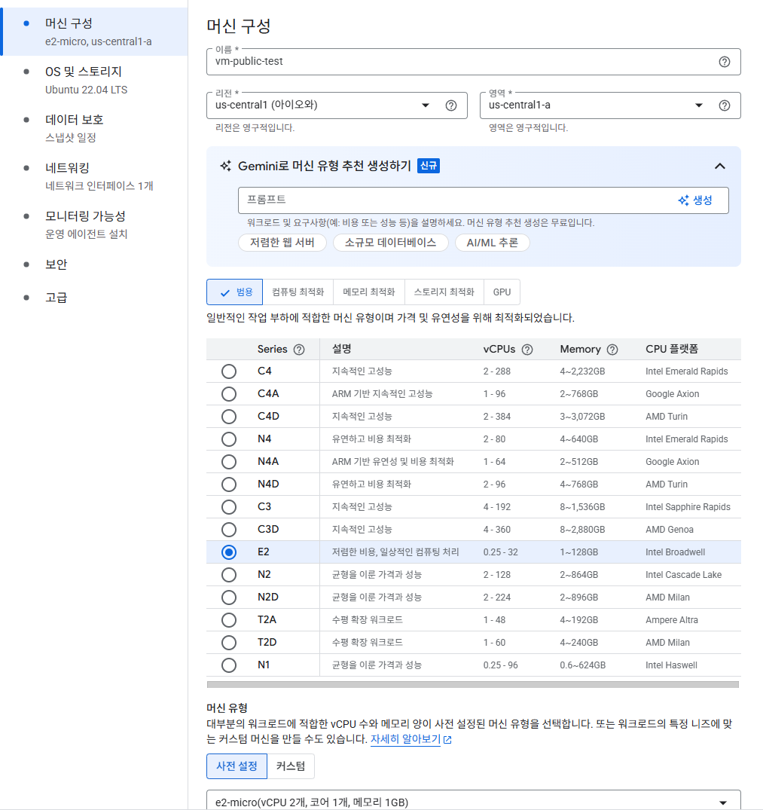
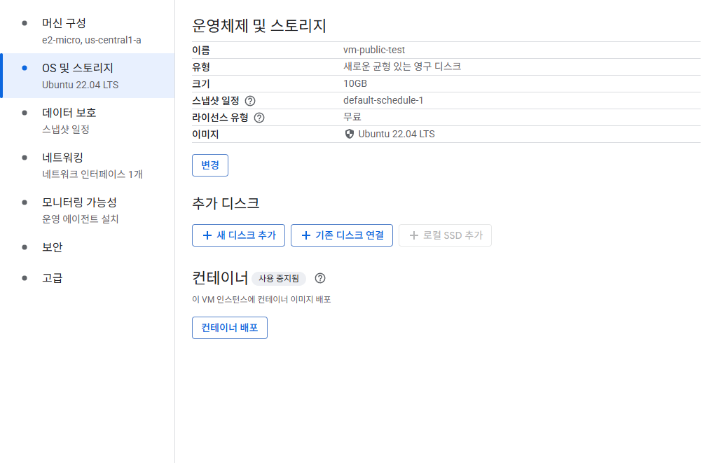
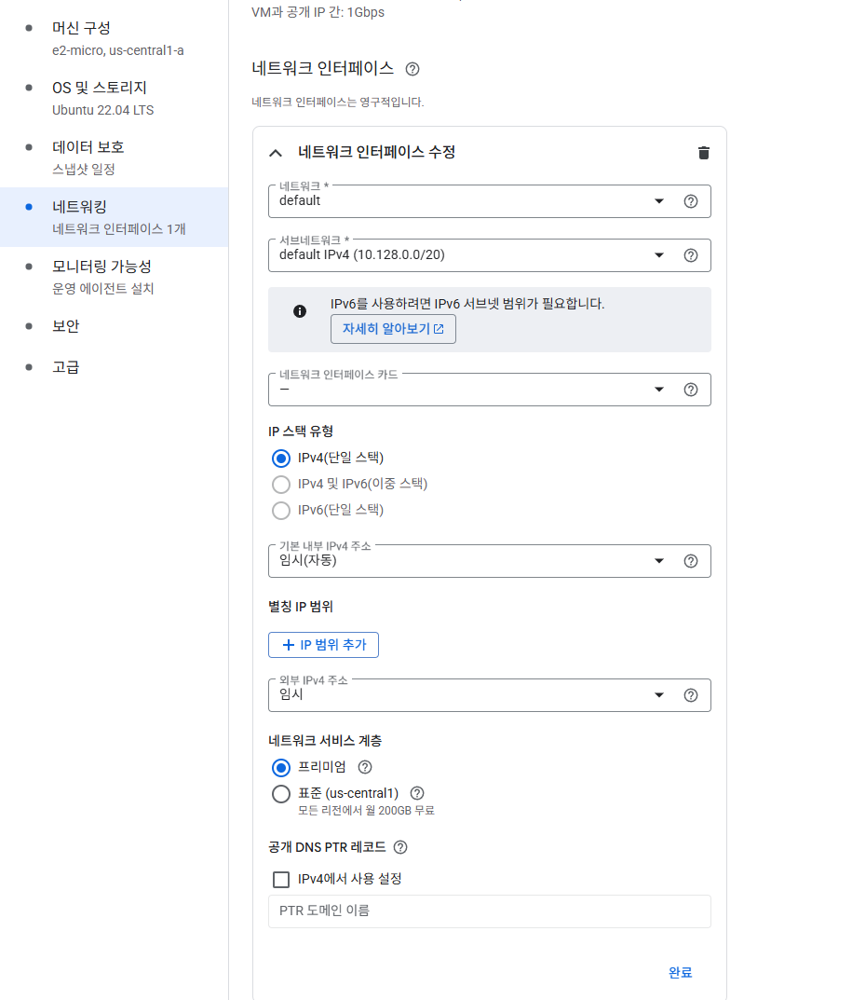
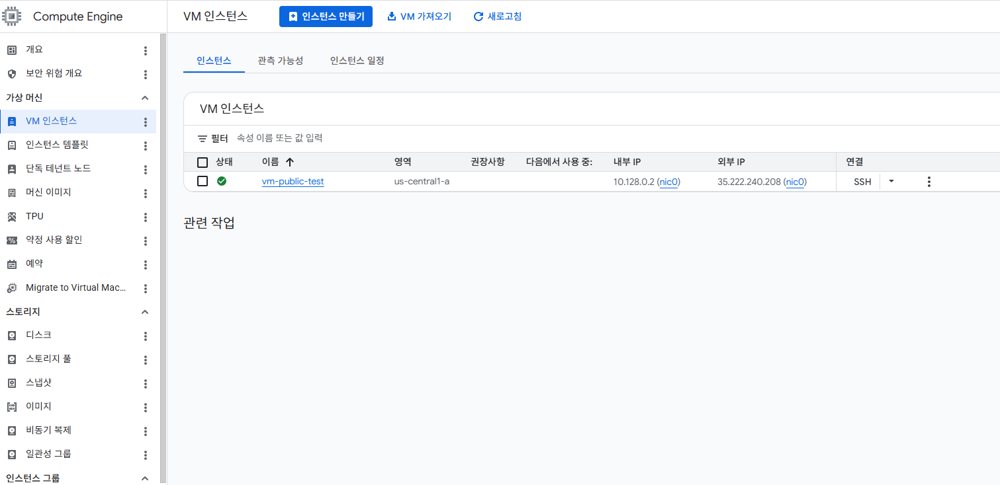
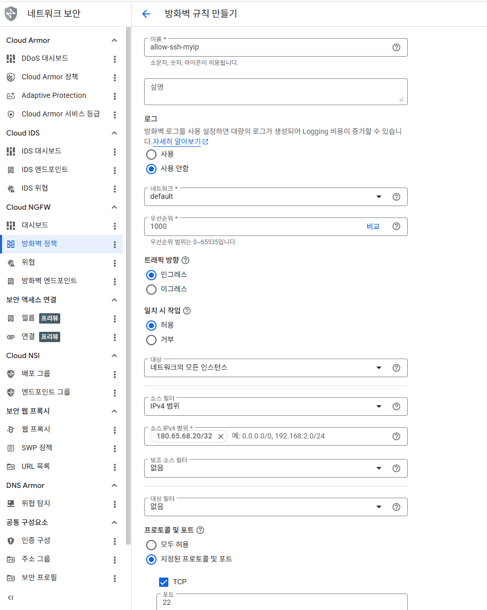
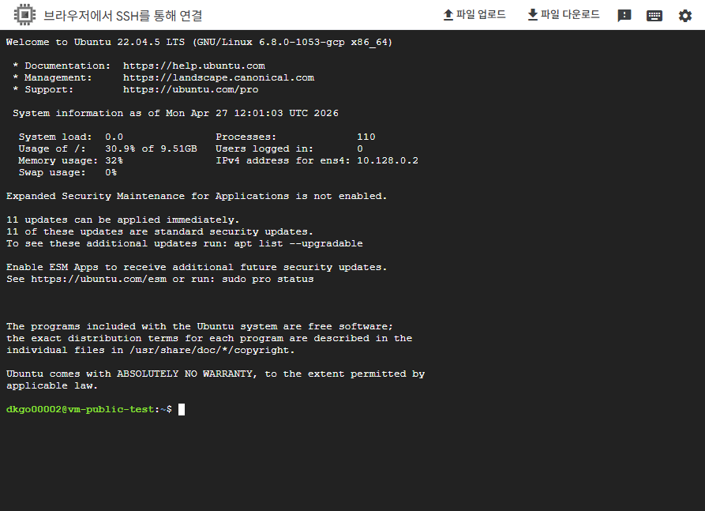
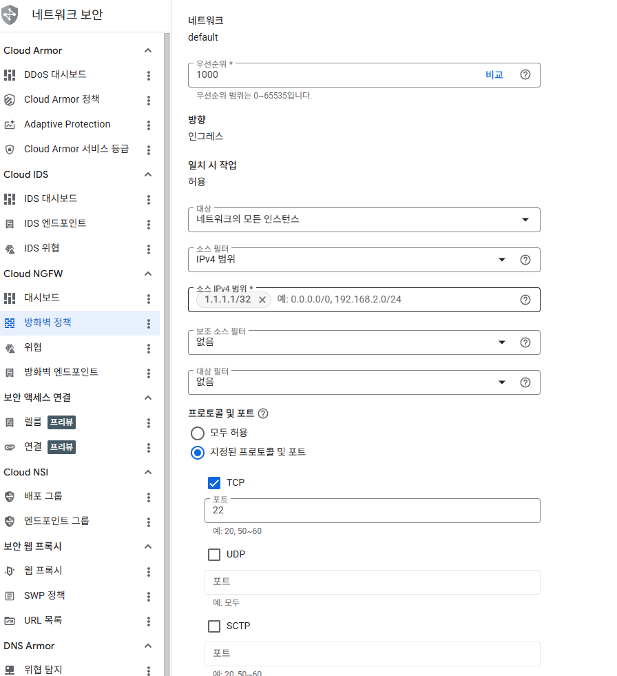

# Step 1-1 : Public VM 생성

- 머신 구성

- os 및 스토리지 선택

- 네트워크 외부 IPv4 주소 = 임시 로 설정

- 임시: 외부 IP 자동 할당, VM 재시작 시 IP 변경됨 (실습/테스트용)
없음: 외부 IP 미할당 → 인터넷 직접 접근 불가 (Private VM)
고정: 외부 IP 고정, 재시작해도 유지됨 (실제 서비스 운영용, 별도 비용 발생)

- 생성

# Step 1-2 : 방화벽으로 특정 IP 접근 제어

- 방화벽 규칙 만들기

- vm 인스턴스에서 ssh 눌러서 터미널 접속 (방화벽 설정 전에 가능) (아니면 GCP IP를 등록하던가)

- WSL 에서 직접 접근테스트

- gcloud compute ssh vm-public-test --zone=us-central1-a 로 ssh 키 등록 후 접속

- 방화벽역할 확인위해 만들어둔 방화벽 1.1.1.1/32로 수정 후 재 진입테스트

- 계속 timeout 나는 상태

- 방화벽이 잘 작동하는걸 확인할 수 있다.

핵심 포인트

- 방화벽 규칙은 우선순위가 낮을수록 먼저 적용 (숫자 낮을수록 우선)

- default-allow-ssh 같은 기본 규칙이 있으면 내가 만든 규칙이 의미 없어짐 → 반드시 확인하고 삭제

- 외부 IP는 임시라서 VM 재시작하면 바뀜 → 고정 IP 필요하면 정적 IP 할당
