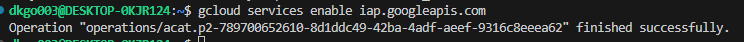
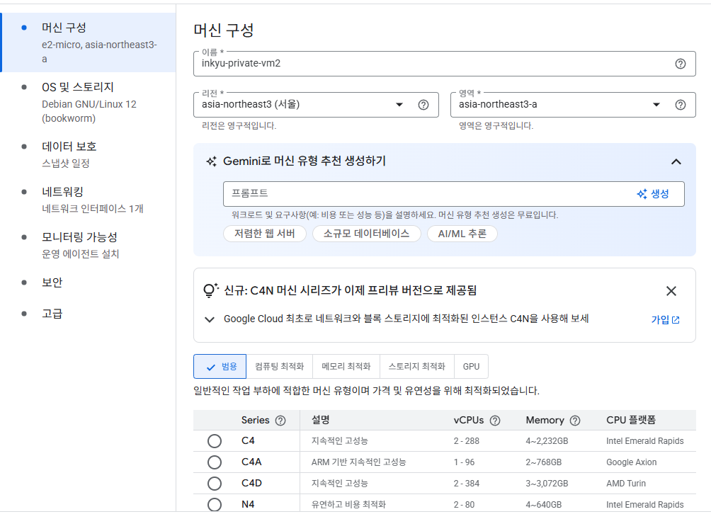
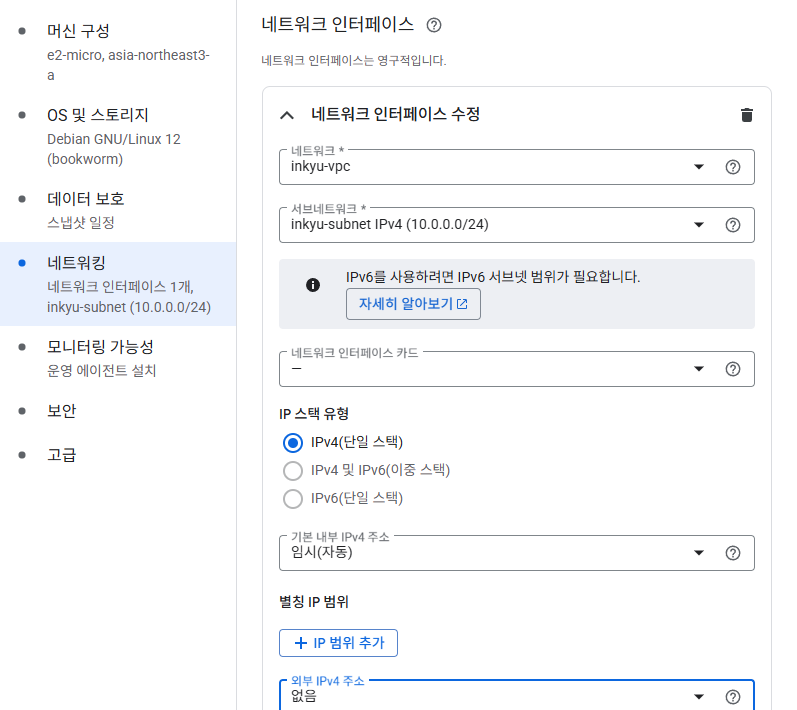
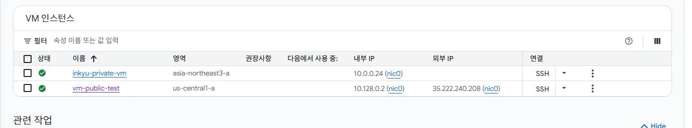
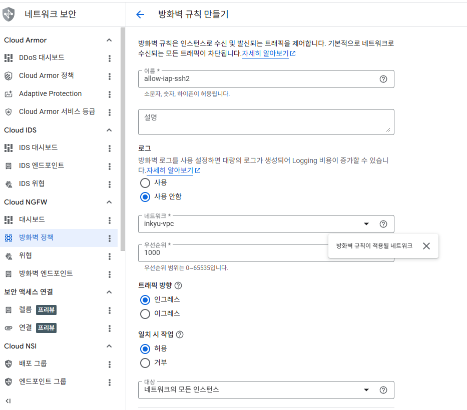
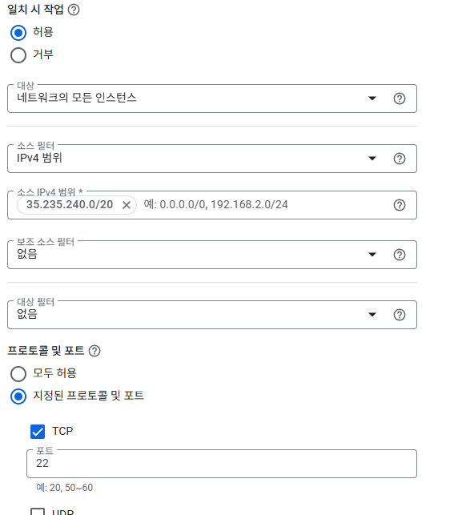
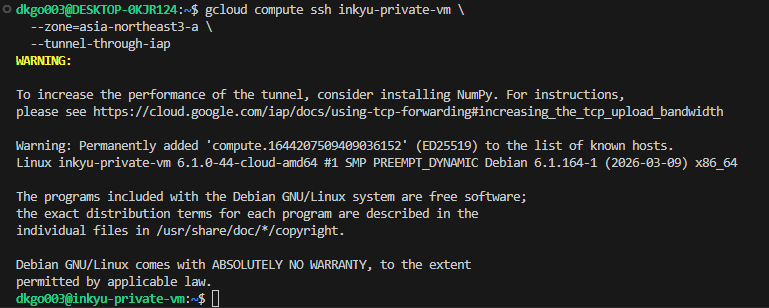

## 목표

외부 IP가 없는 Private VM을 생성하고, IAP(Identity-Aware Proxy)를 통해 SSH 접속하는 구조를 실습한다.

---

## Step 1 vs Step 2 비교

> 실무에서 Production VM은 대부분 Step 2 방식으로 운영한다.

---

## 아키텍처

```json
[로컬 PC / WSL]
     │
     │  gcloud compute ssh --tunnel-through-iap
     ▼
[Google IAP 서버 (35.235.240.0/20)]
     │
     │  인증된 사용자만 통과
     ▼
[Private VM — 외부 IP 없음]
  inkyu-private-vm
  내부 IP: 10.0.0.24
  VPC: inkyu-vpc / 서브넷: inkyu-subnet
```

---

## 사용 리소스

---

## Step 2-1 : IAP API 활성화

```bash
gcloud services enable iap.googleapis.com
```

> Operation ... finished successfully 출력 시 완료



---

## Step 2-2 : Private VM 생성

Compute Engine → VM 인스턴스 → 인스턴스 만들기

### 머신 구성

- 이름: inkyu-private-vm

- 리전: asia-northeast3 (서울)

- 영역: asia-northeast3-a

- 머신 유형: e2-micro



### 네트워킹 탭

- 네트워크: inkyu-vpc

- 서브넷: inkyu-subnet (10.0.0.0/24)

- 외부 IPv4 주소: 없음 ← 핵심 설정



외부 IPv4 주소 옵션 설명

- 임시: 외부 IP 자동 할당, VM 재시작 시 변경됨 (Step 1에서 사용)

- 없음: 외부 IP 미할당 → 인터넷 직접 접근 불가 → IAP로만 접속 가능

- 고정: 재시작해도 IP 유지 (실서비스용, 별도 비용)

### 생성 결과 확인

VM 목록에서 inkyu-private-vm의 외부 IP 칸이 비어있으면 정상



---

## Step 2-3 : 방화벽 규칙 추가

VPC 네트워크 → 방화벽 → 방화벽 규칙 만들기





> 35.235.240.0/20 은 Google이 IAP 서비스에 고정으로 사용하는 IP 대역 (공식 문서 명시)
Step 1의 방화벽이 내 로컬 IP를 소스로 설정했다면, Step 2는 IAP 서버 대역이 소스

---

## Step 2-4 : IAP SSH 접속 테스트

WSL 터미널에서:

```bash
gcloud compute ssh inkyu-private-vm \
  --zone=asia-northeast3-a \
  --tunnel-through-iap
```

접속 성공 시 VM 내부 프롬프트 진입 확인



---

## 핵심 개념 정리

### IAP (Identity-Aware Proxy)란?

Google Cloud가 제공하는 인증 기반 접근 제어 프록시 서비스다.
기존에는 서버에 접근하려면 방화벽에서 IP를 열거나 VPN을 구성해야 했지만,
IAP는 Google 계정 인증을 통과한 사용자에게만 접근을 허용하는 방식으로 이를 대체한다.

동작 방식

```bash
사용자 → Google IAP (인증 확인) → 통과 시 VM으로 터널링
                                  → 실패 시 차단
```

- VM에 공인 IP가 없어도 SSH 접속 가능

- Google 계정 + IAM 권한으로 접근 제어 (별도 VPN 불필요)

- VM 입장에서는 35.235.240.0/20 대역에서 요청이 들어오는 것처럼 보임

- 접속 로그가 Cloud Audit Logs에 자동 기록됨

IAP를 쓰는 상황

IAP가 필요 없는 상황

- 이미 사내 VPN이 잘 구성되어 있을 때

- 완전히 폐쇄된 내부망에서만 운영할 때

### VPC / 서브넷 / VM 관계

```bash
VPC (inkyu-vpc)              ← 네트워크 전체 (아파트 단지)
  └── 서브넷 (inkyu-subnet)  ← 네트워크 구역 (동)
        └── VM               ← 실제 서버 (호수)
```

---

## 트러블슈팅 메모

---

## 핵심 포인트

- 외부 IP 없음 설정만으로 인터넷 직접 노출 차단 가능

- IAP 방화벽 소스는 항상 35.235.240.0/20 고정

- -tunnel-through-iap 옵션 하나로 VPN 없이 Private VM SSH 가능

- default-allow-ssh 같은 기본 규칙 있으면 보안 의미 없어짐 → 반드시 확인/삭제
